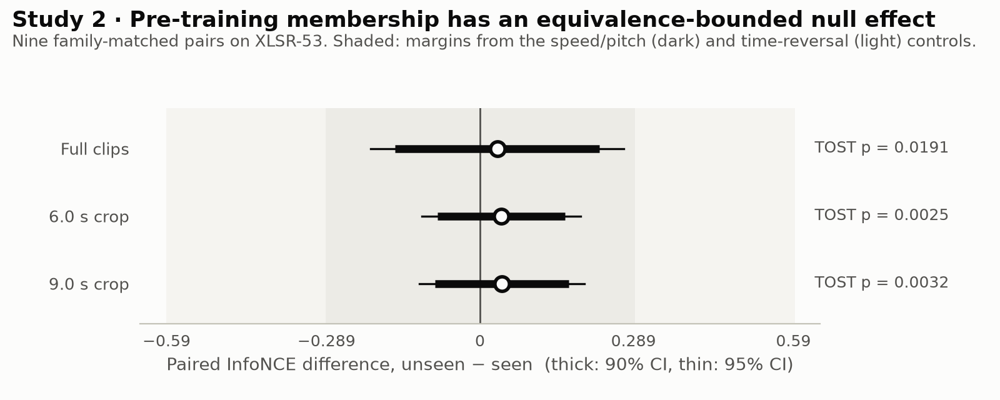
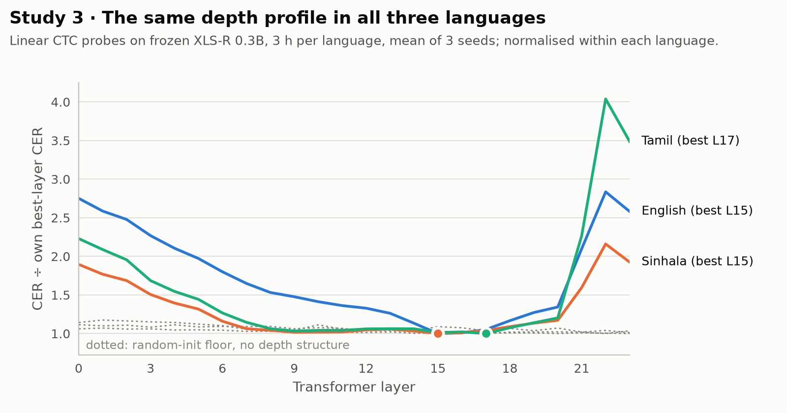
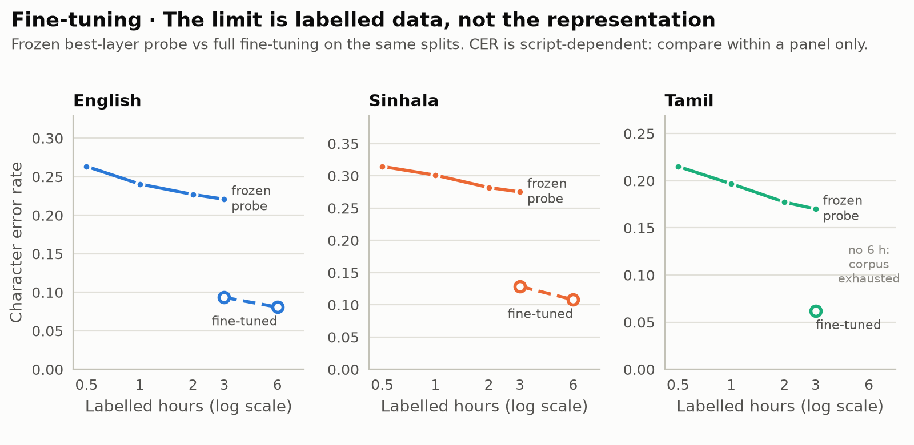
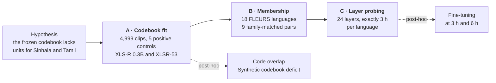

<div align="center">

# XLS-R codebook experiments

**Is the acoustic codebook the bottleneck for low-resource speech recognition?**<br>
Pre-registered, equivalence-bounded tests on Sinhala and Tamil with XLS-R 0.3B and XLSR-53.

[](docs/reproducing.md#environment)
[](docs/reproducing.md#environment)
[](docs/reproducing.md#environment)
[](docs/methodology.md#pre-registration-and-amendments)
[](LICENSE)

[Key findings](#key-findings) · [Results](#results) · [Study design](#study-design) · [Repository layout](#repository-layout) · [Reproducing](#reproducing) · [Documentation](docs/README.md) · [Citation](#citation) · [License](#license)

</div>

---

Self-supervised speech models such as XLS-R still leave a wide gap between high- and
low-resource languages. For wav2vec 2.0-style models an obvious suspect is the product
quantizer: its codebook is learned on pre-training data dominated by a few languages, so it
may hold no codevectors near the sounds of a scarce one. If so, extending the codebook would
be a direct remedy.

This repository tests that premise before anything is built on it, in three pre-registered
experiments and three post-hoc checks. Each one is validated against a control that is known
to fail, and reported with the confounds it cannot separate.

## Key findings

- **The usual diagnostic cannot answer the question.** The quantization residual
  `‖z − q‖²` is undefined for wav2vec 2.0: `z` is 512-d, `q` is 768-d, and the codevectors
  are never trained to reconstruct `z`. Its unmasked substitute is nearly blind, rating white
  noise only 1.11× English. Measuring at *masked* positions instead gives an instrument with
  real range: white noise collapses the positive–negative gap from +0.453 to +0.010.
- **Sinhala and Tamil are fit no worse than English** (0.93–0.95× English's InfoNCE on
  read speech) and **use the same codebook entries**: Jaccard overlap 0.98–1.00 with
  English's used set, and every frame lands on a code English also uses.
- **Pre-training membership has an equivalence-bounded null effect.** Across 18 languages in
  nine family-matched pairs, every 90% CI lies inside a margin equal to removing 27–43% of a
  language's codebook entries (TOST p ≤ 0.019).
- **No depth-localised penalty.** Linear CTC probes on all 24 layers peak at layers 15, 17
  and 15 for Sinhala, Tamil and English, well within the pre-registered tolerance of a
  three-layer shift.
- **The limit is labelled data, not the representation.** Fine-tuning at the same 3 h budget
  removes 53–64% of the frozen-probe error in every language, and keeps improving at 6 h.

The one language-specific signal, probe instability at the best layers, could not be
separated from corpus.

## Results

<picture>
  <source media="(prefers-color-scheme: dark)" srcset="docs/assets/fig1-codebook-fit-dark.png">
  
</picture>

**Experiment A.** The masked instrument separates corrupted audio from speech, and places
every Sinhala and Tamil arm at or below English. The YouTube arms' advantage partly
reflects their three-times-longer clips, so the claim rests on the length-matched read arms.
[Details →](docs/experiment-a.md)

<picture>
  <source media="(prefers-color-scheme: dark)" srcset="docs/assets/fig2-codebook-deficit-dark.png">
  
</picture>

**Synthetic codebook deficit (post-hoc).** With the audio untouched and codebook entries
removed, the metric responds at once: removing 10% of English's entries already exceeds
every language difference in Experiment B. A codebook that lacked units for a language would
have been seen. [Details →](docs/experiment-a.md#synthetic-codebook-deficit)

<picture>
  <source media="(prefers-color-scheme: dark)" srcset="docs/assets/fig3-equivalence-dark.png">
  
</picture>

**Experiment B.** Paired differences of +0.033, +0.040 and +0.041 across the three context
regimes, all statistically equivalent to zero. A negative control on XLS-R 0.3B, which saw
17 of the 18 languages, gives d_z = −0.01. [Details →](docs/experiment-b.md)

<picture>
  <source media="(prefers-color-scheme: dark)" srcset="docs/assets/fig4-layer-profiles-dark.png">
  
</picture>

**Experiment C.** Character information peaks at layers 15–17 and speaker identity at
layer 4 in all three languages; a randomly initialised model shows no depth structure.
[Details →](docs/experiment-c.md)

<picture>
  <source media="(prefers-color-scheme: dark)" srcset="docs/assets/fig5-budget-dark.png">
  
</picture>

**Fine-tuning (post-hoc).** No language has saturated at 3 h, fine-tuning halves the error,
and doubling the data keeps helping, the low-resource language slightly more.
[Details →](docs/experiment-c.md#post-hoc-fine-tuning-at-3-h-and-6-h)

### At a glance

| | Question | Answer | Status |
|---|---|---|---|
| **A** | Is the codebook a worse fit for Sinhala and Tamil than for English? | No: fit no worse, same entries used | Pre-registered |
| | Would the metric see a damaged codebook? | Yes: 10% of entries removed exceeds every language difference | Post-hoc |
| **B** | Does pre-training membership predict codebook fit across 18 languages? | No: equivalent to zero in three context regimes | Pre-registered |
| **C** | If not the codebook, is there a penalty at some depth? | No: best layer and depth centroid within the pre-registered tolerance | Pre-registered |
| | Does the frozen representation limit adapted performance? | No: fine-tuning halves the error at 3 h and still improves at 6 h | Post-hoc |

## Study design



Every experiment follows the same rules, set out in the
[methodology](docs/methodology.md):

1. **Pre-register.** Design, comparisons and decision criteria are committed before any
   result exists; changes are recorded as dated amendments, never edited silently.
2. **Validate the instrument.** A null is only read as a null after a positive control shows
   the measurement can move.
3. **Bound the null.** Absence claims use equivalence tests against a margin calibrated on
   those controls, not a non-significant p-value.
4. **Label the rest.** Analyses added after review are marked post-hoc everywhere they appear.

## Repository layout

```
.
├── Experiment_A_Diagnostic/     # codebook fit, controls, code overlap, codebook deficit
│   ├── results/                 #   XLS-R 0.3B outputs (+ codebook_deficit/)
│   └── results_xlsr53/          #   XLSR-53 outputs
├── Experiment_B_Multilingual/   # 18-language seen/unseen sweep and equivalence tests
│   └── results/
├── Experiment_C_LayerProbe/     # layer-wise probes, collapse rate, fine-tuning
│   └── results/
├── docs/                        # methodology, per-experiment pages, data, reproduction
│   ├── assets/                  #   figures (light and dark)
│   └── scripts/make_figures.py  #   regenerates every figure from versioned results
├── PAPER.html                   # technical report of the pre-registered experiments
├── CITATION.cff
└── LICENSE
```

Result files are versioned; audio, staged copies and the ~150 GB feature cache are not.
Every script regenerates what it needs. See [Data](docs/data.md).

## Reproducing

```bash
python -m venv ~/venv
~/venv/bin/pip install torch torchaudio --index-url https://download.pytorch.org/whl/cu130
~/venv/bin/pip install transformers soundfile numpy scipy pandas pyarrow matplotlib
```

The experiments ran on an NVIDIA DGX Spark (GB10, ARM64, CUDA 13.0). On ARM64, use the
`cu130` wheel index; the commonly cited `cu121` wheels do not exist for aarch64.

The full run order for each experiment, the storage paths some scripts read from, and
runtimes are in **[docs/reproducing.md](docs/reproducing.md)**. To regenerate the figures on this page from
the versioned results, with no data or GPU needed:

```bash
python docs/scripts/make_figures.py
```

## Documentation

| | |
|---|---|
| [Methodology](docs/methodology.md) | The instrument, positive controls, equivalence testing, pre-registration |
| [Experiment A](docs/experiment-a.md) | Codebook fit, code overlap, synthetic codebook deficit |
| [Experiment B](docs/experiment-b.md) | Pre-training membership across 18 languages |
| [Experiment C](docs/experiment-c.md) | Layer-wise probing, probe collapse, fine-tuning |
| [Data](docs/data.md) | Corpora, licences, sampling, what is versioned |
| [Reproducing](docs/reproducing.md) | Environment, run order, runtimes |
| [`PAPER.html`](PAPER.html) | Full technical report of the pre-registered experiments; predates the post-hoc analyses |

## Limitations

- Apart from the YouTube arm of Experiment A, all audio is **read speech**; practical
  systems face spontaneous speech.
- **Language and corpus are confounded** throughout (English is Common Voice; Sinhala and
  Tamil are OpenSLR), and the one attempt to separate them was inconclusive.
- The equivalence margins exclude **sizeable** deficits only, equivalent to removing 13–43%
  of a language's codebook entries; a smaller deficit could pass undetected.
- Samples are small: nine pairs in Experiment B, three languages in Experiment C. Absolute
  CER cannot be compared across scripts.
- The claims are scoped to **product-quantized** models; HuBERT-family objectives are not
  tested.

## Citation

If you use this code or these results, please cite the repository. Citation metadata is in
[`CITATION.cff`](CITATION.cff), and GitHub's **Cite this repository** button produces APA
and BibTeX from it.

```bibtex
@software{hussaindeen_xlsr_codebook_experiments,
  author = {Anas Hussaindeen and Ifadha Imthiyas and Vihanga Muthumala and
            Samadhi Talagala and Uthayasanker Thayasivam},
  title  = {{XLS-R} codebook experiments: equivalence-bounded tests of the acoustic
            codebook on {Sinhala} and {Tamil}},
  url    = {https://github.com/EchoVerge-Labs/XLS-R-codebook-experiment},
  year   = {2026}
}
```

## License

The code in this repository is released under the [MIT License](LICENSE).

The corpora and model checkpoints it uses are not part of this repository and keep their
own licences: CC BY-SA 4.0 for the OpenSLR corpora, CC BY 4.0 for FLEURS, CC0 for Common
Voice, and Apache 2.0 for the XLS-R checkpoints. The in-the-wild YouTube audio is not
redistributed. See [Data](docs/data.md) for details.

---

<sub>Department of Computer Science and Engineering, University of Moratuwa, Sri Lanka.</sub>
