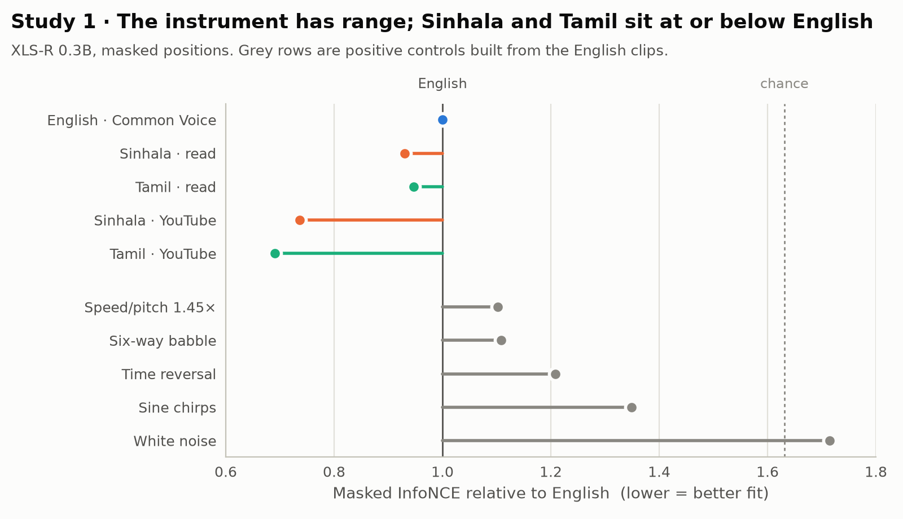
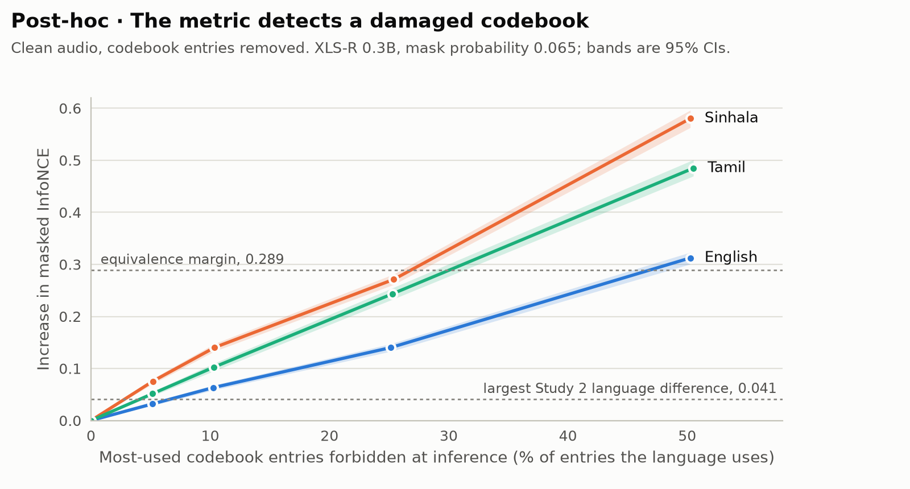

# Experiment A: codebook fit

**Question.** Does the frozen XLS-R codebook fit Sinhala and Tamil worse than English?

**Answer.** No. On the masked-position instrument, Sinhala and Tamil are fit no worse than
English, and they draw on the same codebook entries English does. A post-hoc test shows
the instrument would have registered a damaged codebook.

<picture>
  <source media="(prefers-color-scheme: dark)" srcset="assets/fig1-codebook-fit-dark.png">
  
</picture>

## Design

| | |
|---|---|
| Model | XLS-R 0.3B (`facebook/wav2vec2-xls-r-300m`); XLSR-53 (`facebook/wav2vec2-large-xlsr-53`) as a secondary checkpoint |
| Arms | Sinhala and Tamil in the wild (YouTube); read Sinhala (OpenSLR-30); read Tamil (OpenSLR-65); read English (Common Voice 17) |
| Sample | 1,000 clips per arm, truncated to 30 s; one Sinhala YouTube clip failed to load, leaving 4,999 |
| Controls | Five positive controls of 300 clips each, derived from the English clips ([Methodology](methodology.md#positive-controls)) |
| Measurement | Masked InfoNCE and positive–negative gap, three mask draws per file ([Methodology](methodology.md#the-instrument-masked-position-contrastive-fit)) |

The read arms are the primary comparison. They match English in clip length and carry no
risk of code-switching; the YouTube clips are about three times longer, and because
distractors come from the same utterance, a longer clip offers a richer pool.

## Results

Source: [`results/masked_summary.json`](../Experiment_A_Diagnostic/results/masked_summary.json)
and the per-file JSONs beside it.

| Condition | Mean clip (s) | InfoNCE | × English | Gap | × English |
|---|---:|---:|---:|---:|---:|
| English, Common Voice | 5.1 | 2.829 | 1.00 | 0.453 | 1.00 |
| Sinhala, read | 5.8 | 2.632 | 0.93 | 0.489 | 1.08 |
| Tamil, read | 5.9 | 2.678 | 0.95 | 0.484 | 1.07 |
| Sinhala, YouTube | 14.7 | 2.085 | 0.74 | 0.540 | 1.19 |
| Tamil, YouTube | 16.6 | 1.955 | 0.69 | 0.559 | 1.24 |
| *Speed/pitch 1.45×* | 7.6 | 3.118 | 1.10 | 0.419 | 0.93 |
| *Six-way babble* | 5.3 | 3.135 | 1.11 | 0.334 | 0.74 |
| *Time reversal* | 5.3 | 3.419 | 1.21 | 0.328 | 0.72 |
| *Sine chirps* | 5.3 | 3.816 | 1.35 | 0.351 | 0.77 |
| *White noise* | 5.3 | 4.852 | 1.71 | 0.010 | 0.02 |

Lower InfoNCE and a larger gap mean better fit. White noise collapses the gap and pushes
InfoNCE slightly above chance (4.62), because a log-sum-exp over noisy logits exceeds its
value over equal ones.

### A natural experiment on XLSR-53

XLSR-53's pre-training included Tamil but not Sinhala, yet the two behave alike. Source:
[`results_xlsr53/masked_summary.json`](../Experiment_A_Diagnostic/results_xlsr53/masked_summary.json).

| Arm | Sinhala (unseen) | Tamil (seen) |
|---|---:|---:|
| YouTube | 0.87× | 0.82× |
| Read | 1.01× | 1.03× |

At pre-training mask density (0.65) the read ratios become 1.07× and 1.10×, again with
the seen language the higher; the shift does not follow membership.

## Post-hoc analyses

Both were added after review and are not pre-registered.

### Code overlap

The codebook hypothesis is mechanistic: a language with no nearby codevectors should use a
*different* region of the codebook, or be squeezed onto a *smaller* one. Neither happens.

Each condition is reduced to the same 30,000 gated frames, drawn without replacement and
averaged over 20 draws, because support size depends on sample size. Source:
[`results/code_overlap.json`](../Experiment_A_Diagnostic/results/code_overlap.json), from
[`code_overlap.py`](../Experiment_A_Diagnostic/code_overlap.py).

| Condition | Entries used (of 320 per group) | Jaccard with English | Jensen–Shannon from English |
|---|---:|---:|---:|
| English | 97.5 | 1.000 | 0 |
| Sinhala, YouTube | 96.7 | 0.991 | 0.036 |
| Tamil, YouTube | 97.3 | 0.998 | 0.051 |
| Sinhala, read | 95.8 | 0.981 | 0.082 |
| Tamil, read | 96.3 | 0.985 | 0.059 |
| *Speed/pitch 1.45×* | 97.0 | 0.996 | 0.079 |
| *Sine chirps* | 69.9 | 0.726 | 0.427 |
| *White noise* | 6.7 | 0.073 | 0.645 |

Every Sinhala and Tamil frame lands on a code English also uses. Only frequencies differ,
by about as much as English differs from a speed-shifted copy of itself, while genuine
loss of inventory registers clearly. Languages remain separable by code frequency, but
they share one inventory.

### Synthetic codebook deficit

The positive controls corrupt the audio. This test keeps the audio clean and damages the
**codebook**: chosen entries are forbidden at inference (their quantizer logits set to
−∞), so affected frames fall back to their next-best entry while clips, masks and
distractors stay unchanged. Source:
[`results/codebook_deficit/`](../Experiment_A_Diagnostic/results/codebook_deficit/), from
[`codebook_deficit.py`](../Experiment_A_Diagnostic/codebook_deficit.py).

<picture>
  <source media="(prefers-color-scheme: dark)" srcset="assets/fig2-codebook-deficit-dark.png">
  
</picture>

Increase in masked InfoNCE when the most-used entries are removed (XLS-R 0.3B, mask
probability 0.065, 95% bootstrap CI):

| Removed | English | Sinhala | Tamil |
|---|---:|---:|---:|
| 10% | 0.063 [0.058, 0.068] | 0.140 [0.133, 0.148] | 0.103 [0.095, 0.110] |
| 25% | 0.140 [0.133, 0.147] | 0.271 [0.261, 0.281] | 0.243 [0.232, 0.254] |
| 50% | 0.312 [0.300, 0.323] | 0.580 [0.563, 0.596] | 0.485 [0.470, 0.501] |

**Decision rules**, fixed in the script before it ran:

- **R1 (sensitivity): passed.** Removing 10% of English's entries raises InfoNCE by 0.063,
  above the largest language difference in Experiment B (0.041), with a CI excluding zero.
- **R3 (null): not triggered.** Had removing 50% failed to exceed 0.041, the codebook
  conclusions of Experiments A and B would have been withdrawn.

Share of a language's used entries whose removal reaches the ±0.289 equivalence margin:

| Model | Mask probability | English | Sinhala | Tamil |
|---|---|---:|---:|---:|
| XLS-R 0.3B | 0.065 | 47% | 26% | 30% |
| XLS-R 0.3B | 0.65 | 49% | 29% | 31% |
| XLSR-53 | 0.065 | 43% | 27% | 32% |
| XLSR-53 | 0.65 | 41% | 28% | 32% |

So the margin used in Experiment B corresponds to removing 27–43% of a language's
entries on XLSR-53. The margin excludes sizeable deficits only; a smaller one could pass
undetected.

## Files

| File | Role |
|---|---|
| [`inventory.py`](../Experiment_A_Diagnostic/inventory.py), [`sample_and_stage.py`](../Experiment_A_Diagnostic/sample_and_stage.py) | Inventory the corpora and draw the deterministic sample (seed 1234) |
| [`build_read_manifest.py`](../Experiment_A_Diagnostic/build_read_manifest.py) | Rebuild the read-arm sample from public sources, without the Drive mount |
| [`make_controls.py`](../Experiment_A_Diagnostic/make_controls.py) | Build the five positive controls |
| [`stage_a_diagnostic.py`](../Experiment_A_Diagnostic/stage_a_diagnostic.py) | Frame-level diagnostic: unmasked residual, entropy, code assignments |
| [`masked_probe.py`](../Experiment_A_Diagnostic/masked_probe.py) | The masked-position instrument |
| [`analyse.py`](../Experiment_A_Diagnostic/analyse.py), [`ladder.py`](../Experiment_A_Diagnostic/ladder.py), [`fig_ladder.py`](../Experiment_A_Diagnostic/fig_ladder.py) | Statistics, sensitivity ladder, figures |
| [`code_overlap.py`](../Experiment_A_Diagnostic/code_overlap.py) | Post-hoc code-overlap analysis |
| [`codebook_deficit.py`](../Experiment_A_Diagnostic/codebook_deficit.py) | Post-hoc synthetic codebook deficit |
